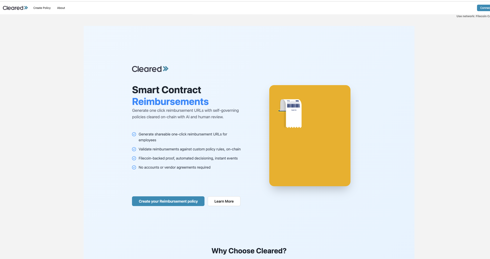
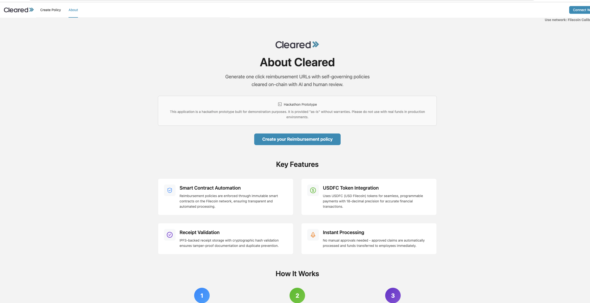
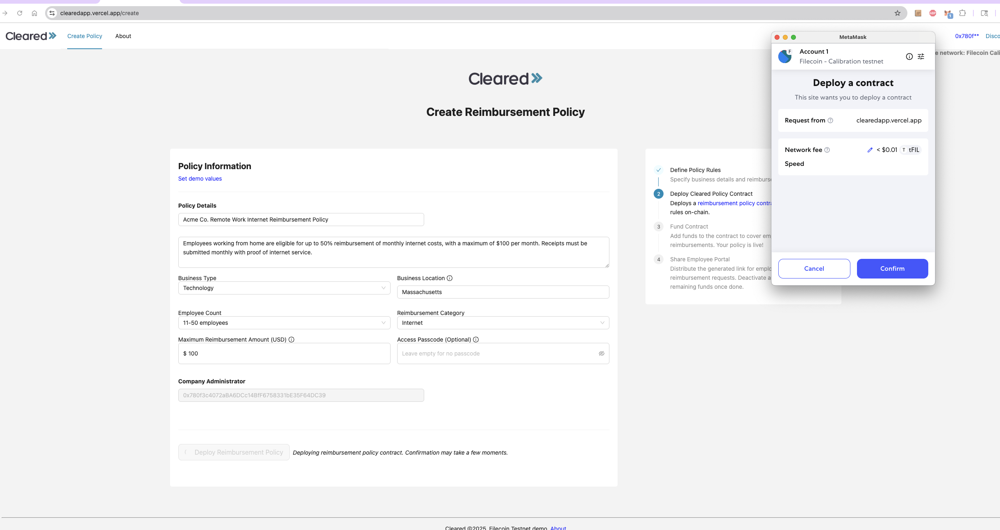
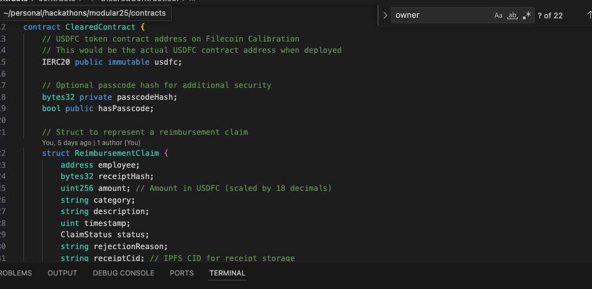
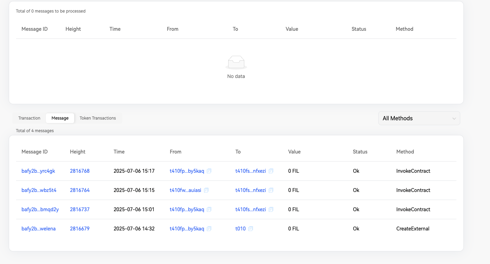
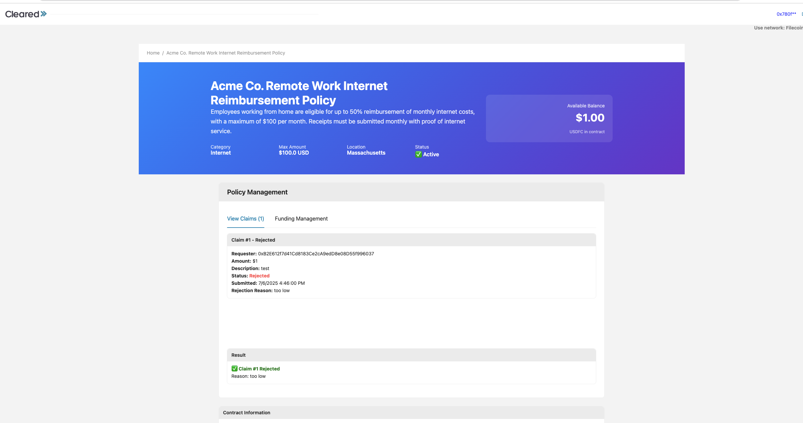

    

Cleared
---

Self-governing reimbursements approved on-chain with AI and human review.

Going for the Modular worlds track and fresh code categories.

Live demo app (deployed on filecoin calibration): https://clearedapp.vercel.app/

Demo Video: https://youtu.be/_v2bU4TZ4_Q

Example reimbursement policy:  https://clearedapp.vercel.app/upload/0x914ad568c5c3a2f803b0F7Af974e382BD994179F

Example backing contract (calibration): https://calibration.filscan.io/en/address/0x914ad568c5c3a2f803b0F7Af974e382BD994179F/#message_list

Built for the DevSpot PL_Genesis hackathon 2025.

## Motivation

Cleared is a self-governing reimbursement platform that automates expense validation and payout using on-chain policy enforcement and decentralized storage. Unlike traditional tools like Ramp or Expensify, which rely on centralized workflows, opaque approval processes, and require user accounts or vendor agreements, Cleared turns reimbursement rules into verifiable, executable smart contracts. This eliminates manual bottlenecks, ensures compliance with real-world labor laws or internal policies, and provides transparent, tamper-proof audit trails — all without third-party dependencies. As businesses face increasing pressure to meet distributed workforce regulations and employees seek trustless accountability, Cleared delivers a programmable, open alternative to today’s black-box finance stacks.

## ⚙️ How It Works

Define Policy Rules
Employers input key details (business type, location, number of employees), and Cleared generates or allows customization of reimbursement rules based on local laws or internal policies.

Deploy Smart Contract
A policy-specific smart contract is deployed to enforce reimbursement rules and log all actions. These contracts evaluate incoming claims with precision and transparency and each policy gets its own smart contract and auditable transaction history.

Submit Receipts
Employees receive a unique link to submit receipts and optional metadata. Submissions are stored on Filecoin/IPFS for permanent, auditable access.

Contract-based Evaluation
Each submission is validated against the policy logic. Humans can review and reimburse requests either from the app or by listening to events emitted from the policy smart contracg.

Reimburse or Notify
If approved, funds are transferred (or queued for payment), and all actions are logged immutably. Denied claims include a transparent reason and proof trail.

### Using the application

1. Connect your wallet as an employer. You can set up as many reimbursement policy pages as you wish.
2. Get testnet USDFC (if on testnet) using this <a href="https://docs.secured.finance/usdfc-stablecoin/getting-started/getting-test-usdfc-on-testnet">guide</a>.
3. Share the url with employees. Users can submit claims through the url until the contract is deactivated or out of funds.

### Running locally

<pre>
yarn
yarn dev
</pre>

### Technologies Used

Filecoin Smart Contracts: Encodes reimbursement rules into verifiable, self-executing policy logic.

Automates approval, denial, and event logging with no manual oversight.

Emits immutable on-chain events for compliance and auditing.

Filecoin Storage: Stores receipts and supporting evidence as content-addressed, tamper-proof data.

Enables transparent, long-term access to reimbursement records.

Removes reliance on centralized storage vendors for sensitive financial data.

USDFC: Enables stable, programmable payouts directly from smart contracts.

Reduces friction in global, on-chain reimbursements.

Integrates easily with programmable treasuries for DAO-native businesses.

AI: Assists in extracting structured data from unstructured receipts.

Maps business attributes to applicable labor and reimbursement regulations.

Generates natural-language feedback explaining approval or denial outcomes.

### Challenges We Ran Into

1. Translating real-world reimbursement policies and compliance laws into deterministic, on-chain logic.

2. Normalizing and validating uploaded receipt data for consistent smart contract evaluation.

3. Designing a decentralized, seamless UX without requiring user accounts or third-party integrations.

### Potential Future Work

1. Develop a reusable policy schema language (e.g., JSON/YAML) for writing and updating reimbursement rules.

2. Integrate ZK-proofs or confidential attestations for private reimbursements while maintaining auditability.

3. Expand Cleared’s library of global policy templates, allowing teams to select rules by country, state, or industry sector.

### Production deployment

`yarn build:prod`: build for filecoin mainnet

### Screenshots

#### Home Page
The main landing page where users can view existing policies and create new reimbursement policies.

#### About Page
Information about Cleared's mission and how the platform works.

#### Create Policy
Policy creation interface where employers define reimbursement rules and deploy smart contracts.

#### Contract Implementation
Example of the deployed smart contract code showing the policy logic implementation.

#### Live Contract Example
A real deployed contract on the Filecoin Calibration testnet demonstrating the platform in action.

#### Claim Rejection Flow
Example of how rejected claims are handled with clear feedback to users.

